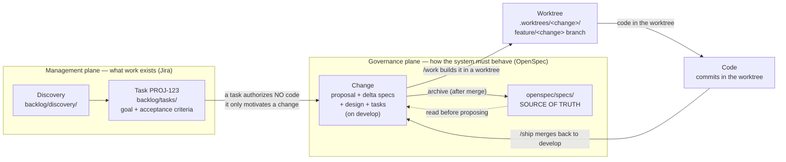

# opsx — Spec-Driven Development Toolkit

[](https://www.npmjs.com/package/@davidpv/opsx)

A stack-agnostic CLI that scaffolds **spec-driven development** on top of [OpenSpec](https://github.com/Fission-AI/OpenSpec), for [opencode](https://opencode.ai), [Claude Code](https://docs.claude.com/en/docs/claude-code) or [Codex](https://developers.openai.com/codex).

The principle: **Spec → Plan → Code.** Code is the last artifact produced, never the first. Every change is structured as proposal + specs + design + tasks, implemented in its own git worktree, with full traceability back to the requirements. It follows the [OpenSpec + git-worktree](https://intent-driven.dev/blog/2026/04/01/openspec-git-worktrees-opencode/) discipline.

## Install

```bash
npx @davidpv/opsx init
```

Needs only **Node.js >= 18** and a git repo. `init` walks you through picking your agent (opencode / Claude Code / Codex), branches, Jira key, and language, then writes everything in place.

## The model: three commands, one principle

Two planes coexist. The **management plane** (Jira) decides *what work exists*; the **governance plane** (OpenSpec) decides *how the system must behave* — and only the latter authorizes code.



A well-written task authorizes nothing: implementation starts only when an OpenSpec change exists, is reviewed, and a worktree is resolved for it. **Jira rules the backlog, the spec rules the code.**

The daily path is just three wrapper commands (with `/next` as a "what now?" helper):

| Command | What it does |
|---|---|
| `/start` | Route new work and chain up to a reviewed proposal on `develop` |
| `/work [changes...]` | Build a change in its own worktree (apply + verify); fans out to SubAgents for multiple changes |
| `/ship <change>` | Verify gate → merge → archive → cleanup worktree → close task |

Everything under `/opsx:*` (and `/task-*`, `/review-*`, `/git-commit`) is an internal primitive the wrappers call — not part of the daily path. **`/git-commit` is the user's tool** — no pipeline command (including the LLM) auto-commits; the user always approves commit messages via `/git-commit`.

## Quick start

```bash
npx @davidpv/opsx init      # pick targets, configure branches, Jira key, language
npx @davidpv/opsx doctor    # verify required tooling (openspec CLI, agent CLIs)
```

Then, inside your agent:

```
/start      # guided entry → reviewed proposal on develop
/work       # build in a worktree (apply + verify)
/ship       # verify + merge + archive + cleanup + close task
```

For non-trivial initiatives, `/start` will chain the backlog steps (requirements interview, task generation, enrichment) before proposing. You never need to invoke those directly.

## Prerequisites

`npx @davidpv/opsx init` needs only Node.js >= 18. To *use* the scaffolded workflow:

| Requirement | Needed for |
|---|---|
| **Git repository** | Branches, worktrees, gates, traceability |
| **OpenSpec CLI** | Every `/opsx:*` command shells out to `openspec` (`npm i -g @fission-ai/openspec`) |
| **An agent CLI** | opencode / Claude Code / Codex (only the targets you selected) |
| **SubAgent support** | `/work` parallel mode (opencode/Claude Code built in; Codex needs config) |
| `gh` / `glab` (optional) | PR automation; otherwise the PR description is written to `backlog/exports/pr/` |

`opsx doctor` checks all of this and reports what's missing.

## Rules that matter

- **Propose on `develop`, never in a worktree.** OpenSpec's conflict detection needs the full view of every active change and the authoritative `openspec/specs/`.
- **Verify before merge.** `/ship` refuses to merge unless a clean verify report exists for the current state of the branch.
- **Merge, then archive.** `/ship` merges `feature/<change>` → `develop` first, then archives (syncs delta specs into `openspec/specs/`) on `develop`.
- **`main` is release-only.** Proposals and merges land on the integration branch (`develop` by default). Each change gets a worktree at `.worktrees/<change>/` on `feature/<change>`. Configure branches and `git.work_mode` (`worktree` / `feature` / `flexible`) in `workflow.yaml`.
- **The LLM never auto-commits.** All commits are user-driven. Every command (`/opsx:*`, `/work`, `/ship`, `/git-commit`, `/task-*`, `/req-capture`) ends by suggesting `/git-commit`, and only the user runs it. After modifying any file — code, specs, artifacts, config — the LLM stages and suggests `/git-commit`; the user reviews the message and finalizes the commit.
- **Spec wrong or drifted?** Never diverge silently — run `/opsx:sync` to fix the spec first, then resume.

Traceability chain: **Discovery → Task (Jira) → Change → tasks.md step → user commits via `/git-commit` → merge → archive**. Task IDs ARE Jira keys (`PROJ-123`; `PROJ-Dnn` for drafts).

## Commands

The three wrappers above are all you need day to day. The primitives they call:

<details>
<summary>Tasks — optional, for non-trivial initiatives</summary>

| Command | What it does |
|---|---|
| `/req-capture <topic>` | Requirements interview → `backlog/discovery/<topic>.md` |
| `/task-import <id>` | Import an existing Jira ticket (you paste it) into `backlog/tasks/` |
| `/task-new <title>` | Create a single task directly (draft ID) |
| `/task-generate <topic>` | Slice a discovery doc into tasks; you provide the Jira IDs |
| `/task-enrich <id>` | Add edge cases, unhappy paths, estimate |
| `/review-task <id>` | Audit a task: sizing, testability, traceability |
| `/task-jira <id\|all>` | Export tasks as Jira wiki markup to `backlog/exports/jira/` |

</details>

<details>
<summary>OpenSpec lifecycle — called by the wrappers</summary>

| Command | What it does |
|---|---|
| `/opsx:explore` | Investigate the codebase/specs before proposing |
| `/opsx:propose <name>` | Create a change (proposal, delta specs, design, tasks) on `develop` |
| `/review-change <name>` | Spec-reviewer audit + `openspec validate --strict` |
| `/opsx:apply <name>` | Create the worktree and implement tasks inside it |
| `/git-commit` | Conventional commit traced to change/step/Jira task — **the user-only commit tool; LLM never auto-commits** |
| `/opsx:verify <name>` | Verify implementation matches artifacts (required before `/ship`) |
| `/opsx:sync` | Sync specs with reality when they drift |
| `/opsx:archive <change>` | Sync delta specs into `openspec/specs/` after merge |
| `/pr-open [name]` | Create a PR against the integration branch (gh/glab/file fallback) |

</details>

## Repository layout

```
.
├── AGENTS.md          # Rules every agent must follow
├── workflow.yaml      # Pipeline config: branches, commits, Jira, worktrees (tool-agnostic)
├── templates/         # discovery.md, task.md, pr-description.md
├── backlog/           # discovery/, tasks/ (Jira IDs), exports/ (jira + pr)
├── .worktrees/        # Per-change git worktrees (gitignored)
├── .opencode/         # commands, skills, agents (or .claude/ / .codex/)
└── openspec/
    ├── config.yaml    # Project context + per-artifact rules
    ├── specs/         # Source of truth (current behavior)
    └── changes/       # In-flight changes; archive/ keeps history
```

## Keeping opsx updated

Upgrading the npm package does **not** deploy new commands/skills to an existing project — you must also run `opsx update`:

```bash
npm update -g @davidpv/opsx     # 1. upgrade the package
npx @davidpv/opsx update        # 2. deploy new/changed files into your project
```

`opsx update` creates new files, overwrites unmodified ones, and keeps files you've edited (use `--force` to overwrite). The `AGENTS.md` managed block and `opencode.json` / `settings.json` keys are merged without clobbering your customizations.

```bash
npx @davidpv/opsx --version     # installed version
npx @davidpv/opsx doctor        # verify tooling and project state
```

Check the [CHANGELOG](https://github.com/anomalyco/opsx-spec-driven-development-toolkit/releases) for breaking changes before updating.
</content>
</invoke>
