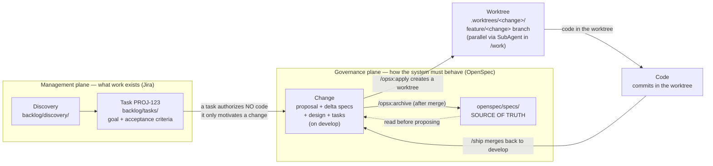

# opsx — Spec-Driven Development Toolkit

[](https://www.npmjs.com/package/@davidpv/opsx)

A stack-agnostic CLI that scaffolds **spec-driven development** on top of [OpenSpec](https://github.com/Fission-AI/OpenSpec), for any of [opencode](https://opencode.ai), [Claude Code](https://docs.claude.com/en/docs/claude-code) and [Codex](https://developers.openai.com/codex).

The core idea: **Spec → Plan → Code.** Code is the last artifact produced, never the first. OpenSpec structures every change as proposal + specs + design + tasks, and opencode executes the implementation with full traceability back to the requirements.

This toolkit follows the **OpenSpec + git-worktree** discipline described in [OpenSpec, Git WorkTrees and OpenCode](https://intent-driven.dev/blog/2026/04/01/openspec-git-worktrees-opencode/): each change lives in its own git worktree, proposes run on the integration branch with the full view of every other change, and the closing button (**`/ship`**) runs in the order **merge → archive**, every time.

## Install

```bash
npx @davidpv/opsx init
```

Or install it globally first if you'd rather call `opsx` directly:

```bash
npm install -g @davidpv/opsx
opsx init
```

That's it — just **Node.js >= 18** and a git repo, nothing else to install upfront. It walks you through picking your agent (opencode / Claude Code / Codex) and writes everything in place. See [Prerequisites](#prerequisites) and [Quick start](#quick-start) below for the rest of the setup.

## The model: four wrapper commands, one principle

Two planes coexist and must not be confused. The **management plane** (Jira vocabulary) decides *what work exists and tracks it*; the **governance plane** (OpenSpec) decides *how the system must behave* — and only the latter authorizes code:




A task being well written changes nothing: implementation starts only when an OpenSpec change exists, is reviewed, and a worktree (or feature branch) is resolved for it. The four wrapper commands are **the entire public surface**:

| Command | What it does |
|---|---|
| `/start` | Entry: route new work (Jira ticket / direct change / new task), chain into the next steps |
| `/next` | Recovery point: detect state and suggest the next step |
| `/work [changes...]` | Multi-agent build: fan out independent changes to SubAgents, each in its own worktree |
| `/ship <change>` | Closing button: verify gate → merge → archive → cleanup worktree → close task |

If a task ever contains design or implementation detail, that content belongs in the change — `task-reviewer` flags it. This is what keeps the workflow *spec-driven* even though the backlog speaks Jira: **Jira rules the backlog, the spec rules the code.**

## Prerequisites

To run `opsx init` itself you only need **Node.js >= 18** (`npx @davidpv/opsx init` works with nothing else installed — it just writes files). To actually *use* the workflow it scaffolds, you need:

| Requirement | Needed for | Install |
|---|---|---|
| **Git repository** | The whole workflow assumes git (branches, worktrees, gates, traceability) | `git init` |
| **OpenSpec CLI** (required) | Every `/opsx:*` command shells out to `openspec` | `npm install -g @fission-ai/openspec` |
| **At least one agent CLI** | Running the commands/skills | opencode: `npm install -g opencode-ai` · Claude Code: `npm install -g @anthropic-ai/claude-code` · Codex: `npm install -g @openai/codex` |
| **SubAgent support** | `/work` multi-agent mode (required for parallel changes; `/start` → `/opsx:apply` works without it) | opencode/Claude Code have it built in; Codex needs the right config |
| `gh` or `glab` (optional) | `/pr-open` PR automation; without them the PR description is written to `backlog/exports/pr/` | [cli.github.com](https://cli.github.com) / [gitlab.com/gitlab-org/cli](https://gitlab.com/gitlab-org/cli) |

You don't need all three agent CLIs — only the ones you selected as targets during `init`. `opsx doctor` checks all of this and tells you exactly what's missing.

## Quick start

```bash
# In your existing project
npx @davidpv/opsx init          # pick targets: opencode / Claude Code / Codex, configure branches, Jira key, language
npx @davidpv/opsx doctor        # verify required tooling (openspec CLI, agent CLIs)
npx @davidpv/opsx update        # after upgrading the opsx package: deploy new commands/skills to your project
```

`init` writes the shared, tool-agnostic layer once (`workflow.yaml`, `AGENTS.md` managed block, `backlog/`, `templates/`, `openspec/`) and a native layer per agent: `.opencode/` (commands + skills + agents + `opencode.json` merge), `.claude/` (commands + skills + subagents + `settings.json` merge + `CLAUDE.md` importing `AGENTS.md`), `.codex/skills/` (skills; commands and reviewers compiled as skills, since Codex has no project-level slash commands or subagents).

Then, inside your agent (shown here with opencode):

```
/start                      # 1. guided entry — routes to the right first command
/work                       # 2. parallel build across SubAgents in worktrees
                            #   (or /opsx:propose + /opsx:apply for a single change)
/ship                       # 3. closing button — verify + merge + archive + cleanup
```

The full pipeline when you do the tasks steps too:

```
/start                          # guided entry: routes you to the right first command
/req-capture checkout-flow      # 0. requirements interview → discovery doc
/task-generate checkout-flow    # 1. tasks with Jira IDs (PROJ-123)
/task-enrich PROJ-123           #    edge cases, scenarios, estimate
/task-jira PROJ-123             #    export as Jira wiki markup
/opsx:propose <name>            # 2. proposal + delta specs + design + tasks on develop
/review-change <name>           # 3. audit before building
/opsx:apply <name>              # 4. create worktree, implement tasks
                                #    (or /work to fan out to SubAgents in parallel)
/opsx:verify <name>             # 5. inside the worktree, before merge
/git-commit                     #    semantic commits traced to tasks
/ship <name>                    # 6. merge → archive → cleanup → close task
```

Stages 0–1 are optional for small technical changes; everything from `/opsx:propose` on is mandatory. `/start` chains steps 1–2 together so a single command can take you from "I want feature X" to "ready in a worktree."

## Workflow

Full map of flows and options. 🧑 = needs human interaction, 🤖 = agentic (runs on its own), 🧑🤖 = agentic with human checkpoint (approval, language gate, or fallback).

```mermaid
flowchart TD
    classDef human  fill:#fff3cd,stroke:#996f00,color:#000
    classDef agent  fill:#d6eaf8,stroke:#1a5276,color:#000
    classDef mixed  fill:#e8daef,stroke:#6c3483,color:#000
    classDef art    fill:#eaeded,stroke:#7f8c8d,color:#000

    START(["New work arrives"]) --> ENTRY["/start 🧑<br/>guided entry"]:::human
    ENTRY --> CASE{"How does this work start?"}

    %% Entry routes
    CASE -- "Jira ticket exists" --> IMP["/task-import 🧑🤖<br/>paste ticket + normalize + task-reviewer"]:::mixed
    IMP --> CHAIN1{"Start the build now?"}
    CHAIN1 -- yes --> PROP
    CHAIN1 -- no --> NEXT
    CASE -- "no ticket:<br/>investigate / propose" --> PROP
    CASE -- "no ticket:<br/>create task first" --> SIZE{"Initiative or single task?"}
    SIZE -- "single task" --> TN["/task-new 🧑🤖<br/>mini interview + draft ID"]:::mixed
    TN --> CHAIN2{"Start the build now?"}
    CHAIN2 -- yes --> PROP
    CHAIN2 -- no --> NEXT
    SIZE -- initiative --> RC["/req-capture 🧑<br/>interview + language gate"]:::human
    RC --> DISC["backlog/discovery/topic.md"]:::art
    DISC --> SG["/task-generate 🧑🤖<br/>language gate + Jira IDs from user"]:::mixed
    SG --> TASKL["backlog/tasks/PROJ-123.md"]:::art
    TASKL --> SE["/task-enrich 🤖<br/>asks only on ambiguity"]:::agent
    SE --> RS["/review-task 🤖"]:::agent
    RS -- REVISE --> SE
    RS -- APPROVE --> JIRAQ{"Export to Jira?"}
    JIRAQ -- yes --> SJ["/task-jira 🧑🤖<br/>language gate + translation"]:::mixed
    SJ --> JEXP["backlog/exports/jira/"]:::art
    JIRAQ -- no --> PROP
    SJ --> PROP

    %% Spec phase (on develop)
    PROP["/opsx:propose 🧑🤖<br/>on develop, never in a worktree<br/>agent writes artifacts, commits each one"]:::mixed
    PROP --> CHG["openspec/changes/name/"]:::art
    CHG --> RV["/review-change 🤖<br/>spec-reviewer + validate --strict"]:::agent
    RV -- REVISE --> FIX["fix artifacts 🤖"]:::agent
    FIX --> RV
    RV -- APPROVE --> PARALLEL{"Build one or many in parallel?"}

    %% Build phase — single change
    PARALLEL -- "one change" --> APPLY
    APPLY["/opsx:apply 🤖<br/>creates the worktree,<br/>runs tasks inside it"]:::agent
    APPLY --> WT["worktree at .worktrees/&lt;change&gt;/<br/>on branch feature/&lt;change&gt;"]:::art
    WT --> VERIFY["/opsx:verify 🤖<br/>runs inside the worktree"]:::agent
    VERIFY -- CRITICAL --> FIXWT["fix in worktree, re-verify 🤖"]:::agent
    FIXWT --> VERIFY
    VERIFY -- clean --> GC["/git-commit 🧑🤖<br/>agent drafts, you approve message"]:::mixed
    GC --> SHIP

    %% Build phase — parallel
    PARALLEL -- "many independent changes" --> WORK
    WORK["/work 🧑🤖<br/>fan out N SubAgents<br/>to N worktrees in parallel"]:::mixed
    WORK --> WTS["N worktrees, one per SubAgent<br/>each runs /opsx:apply + /opsx:verify"]:::art
    WTS --> REPORTS["/work aggregates reports<br/>(no SubAgent may merge)"]:::art
    REPORTS --> SHIPQ{"Verify clean?"}
    SHIPQ -- no --> FIXWT
    SHIPQ -- yes --> SHIP

    %% Delivery phase — one button (/ship)
    SHIP["/ship &lt;change&gt; 🧑🤖<br/>the one-button close"]:::mixed
    SHIP --> VGATE{"Verify gate 🧑<br/>report exists &amp; is current<br/>&amp; has no CRITICAL<br/>blocks any merge until resolved"}
    VGATE -- fails --> VBACK["report the issue, refuse to merge"]:::mixed
    VBACK --> FIXWT
    VGATE -- passes --> MERGE["merge feature/&lt;change&gt; → develop<br/>(squash, gh/glab/web-UI fallback)"]
    MERGE --> ARC["/opsx:archive on develop 🧑🤖<br/>delta specs → openspec/specs/<br/>commit chore(&lt;change&gt;): archive"]
    ARC --> CLEAN["git worktree remove .worktrees/&lt;change&gt;<br/>delete feature/&lt;change&gt; branch"]
    CLEAN --> CLOSE["backlog/tasks/&lt;id&gt;.md: status: done<br/>remind Jira transition"]
    CLOSE --> MORE{"More changes to ship?"}
    MORE -- yes --> SHIP
    MORE -- no --> NEXT["/next 🧑<br/>recovery point: state + suggestion"]
    CLOSE -.back to .-> NEXT
```



> **"Spec wrong or drifted?"** — checkpoint during implementation. *Wrong*: while coding you discover a requirement or scenario was incorrect or incomplete. *Drifted*: `openspec/specs/` no longer matches what the code actually does (hotfixes, old unspec'd commits). In both cases the rule is the same: never diverge silently — run `/opsx:sync` to fix the spec first, then resume `/opsx:apply`. Code must always trace back to a correct spec.

> **Branch discipline — three non-negotiable rules** (matches the [OpenSpec + git-worktrees guide](https://intent-driven.dev/blog/2026/04/01/openspec-git-worktrees-opencode/)):
>
> 1. **Propose on the integration branch (`develop`)** — never inside a worktree. OpenSpec's conflict detection needs the full view of every active change and the authoritative `openspec/specs/`; a proposal written in a worktree branch would only see its own delta.
> 2. **Verify before merge** — `/opsx:verify` runs inside the worktree against the code that will actually be merged. `/ship` refuses to merge unless a clean verify report exists for the current state of the branch.
> 3. **Merge, then archive, every time** — `/ship` does code first (the `feature/<change>` → `develop` merge), then archive (`/opsx:archive` on `develop`, which syncs delta specs into `openspec/specs/` and commits `chore(<change>): archive`). Archive never runs on a worktree branch; spec-sync needs the full view of every other merged change.

> **Branch model** — `main` is release-only and never worked on directly. The integration branch (`git.integration_branch` in `workflow.yaml`, default `develop`) is where proposals and merges land. With `git.work_mode: worktree` (default), every change gets its own git worktree at `<git.worktree.dir>/<change>/` (default `.worktrees/<change>/`) on a fresh branch `feature/<change>` (or `feature/<task-id>-<change>` if the change is linked to a backlog task with a real Jira key like `PROJ-123`). The other modes are still supported for legacy projects: `feature` for plain feature branches, `flexible` for committing directly on the integration branch when code review matters less.

Human checkpoints, summarized: the `/start` entry questions, the `/req-capture` interview, pasting an existing Jira ticket (`/task-import`), every language gate (es/en, mandatory on client-facing text), confirming the parallel build plan (`/work`), approving commit messages (`/git-commit`), providing Jira IDs and pasting Jira exports, and inspecting each SubAgent's verification report before running `/ship`. Everything else runs agentically.

Traceability chain: **Discovery → Task (Jira) → Change → tasks.md step → Commit → merge → archive**. Each link is recorded where it happens: task frontmatter (`change:`), commit footers (`Change:`/`Task:`/`Jira:`), the archive commit on `develop`. Task IDs ARE Jira keys (`PROJ-123`, provided by you; `PROJ-Dnn` drafts until the issue exists). Note the naming: a *task* is a backlog/Jira work item; `tasks.md` inside a change holds implementation steps.

Each change lives in `openspec/changes/<name>/` until archived. Archiving merges its delta specs into `openspec/specs/`, the living description of how the system behaves, via `/ship` (after the merge). `workflow.yaml` configures branches (git-flow by default: `feature/* → develop`), commit convention, worktree settings, and Jira export — commands read it, so the pipeline stays platform-agnostic.

## Repository layout

```
.
├── AGENTS.md                  # Rules every agent must follow
├── opencode.json              # opencode project config
├── workflow.yaml              # Pipeline config: branches, commits, Jira, worktrees (tool-agnostic)
├── templates/                 # discovery.md, task.md, pr-description.md
├── backlog/
│   ├── discovery/             # Requirements-gathering notes (/req-capture)
│   ├── tasks/                 # Tasks with Jira IDs (/task-generate, /task-enrich)
│   └── exports/               # jira/ (wiki markup) and pr/ (fallback PR descriptions)
├── .worktrees/                # Per-change git worktrees (created by /opsx:apply, removed by /ship) — gitignored
├── .opencode/
│   ├── agents/
│   │   ├── spec-reviewer.md   # Subagent: audits changes before apply/archive
│   │   └── task-reviewer.md   # Subagent: audits tasks (sizing, testability)
│   ├── commands/
│   │   ├── start.md           # /start — guided entry point (routes new work)
│   │   ├── next.md            # /next — recovery point
│   │   ├── work.md            # /work — multi-agent parallel build (top-level wrapper)
│   │   ├── ship.md            # /ship — closing button (verify + merge + archive + cleanup)
│   │   ├── req-capture.md     # /req-capture — requirements interview
│   │   ├── task-*.md          # /task-import|new|generate|enrich|jira
│   │   ├── review-*.md        # /review-change, /review-task
│   │   ├── git-commit.md      # /git-commit — semantic commits with traceability
│   │   ├── pr-open.md         # /pr-open — platform-agnostic PR creation (worktree-aware)
│   │   └── opsx-*.md          # /opsx:* — OpenSpec lifecycle (advanced; called by the wrappers)
│   └── skills/                # OpenSpec workflow skills (generated)
└── openspec/
    ├── config.yaml            # Project context + per-artifact rules
    ├── specs/                 # Source of truth (current behavior)
    └── changes/               # In-flight changes; archive/ keeps history
```

## Commands

### Top-level wrappers — the four commands to learn

| Command | Stage | What it does |
|---------|-------|--------------|
| `/start` | Entry | Guided entry point: ask how the work starts and chain into the next steps (propose, worktree, etc.) |
| `/next` | Any | Detect where you are in the pipeline (branch, worktree, change state, PR) and suggest the next step. Always suggests only. |
| `/work [changes...]` | Build | Fan out active changes to one SubAgent each, in its own git worktree. SubAgents apply + verify and report back. They never merge. |
| `/ship <change>` | Close | Verify gate + merge into the integration branch + `/opsx:archive` on `develop` + cleanup worktree + close the linked task. |

### Tasks — optional, for non-trivial initiatives

| Command | Stage | What it does |
|---------|-------|--------------|
| `/req-capture <topic>` | Discover | Guided requirements interview → `backlog/discovery/<topic>.md` |
| `/task-import <id>` | Tasks | Import an existing Jira ticket (you paste it) into `backlog/tasks/` |
| `/task-new <title>` | Tasks | Create a single task directly, without a discovery doc (draft ID) |
| `/task-generate <topic>` | Tasks | Slice a discovery doc into tasks; you provide the Jira IDs |
| `/task-enrich <id>` | Tasks | Add edge cases, unhappy paths, estimate; runs task-reviewer |
| `/review-task <id>` | Tasks | Audit a task: sizing, testability, traceability |
| `/task-jira <id\|all>` | Tasks | Export tasks as Jira wiki markup to `backlog/exports/jira/` |

### OpenSpec lifecycle — advanced; normally called by the wrappers

| Command | Stage | What it does |
|---------|-------|--------------|
| `/opsx:explore` | Spec | Investigate the codebase/specs before proposing |
| `/opsx:propose <name>` | Spec | Create a change: proposal, delta specs, design, tasks. **Runs on `develop`, never inside a worktree.** Commits all artifacts together in one commit. |
| `/review-change <name>` | Spec | Spec-reviewer audit + `openspec validate --strict` |
| `/opsx:apply <name>` | Build | Create the worktree (`feature/<change>`) and implement tasks inside it. With `git.work_mode: feature`, falls back to a plain feature branch. |
| `/git-commit` | Build | Conventional commit traced to change/step/Jira task |
| `/opsx:verify <name>` | Build | Run inside the worktree. Verifies implementation matches artifacts; writes a CRITICAL/WARNING/SUGGESTION report. **Required before `/ship` will merge.** |
| `/opsx:sync` | Build | Sync specs with reality when they drift (runs on `develop`) |
| `/opsx:archive <change>` | Close | Sync delta specs into `openspec/specs/` and file the change. **Runs on `develop`, after merge.** `/ship` calls this internally. |
| `/pr-open [name]` | Deliver | Create the PR against the integration branch (gh/glab/file fallback). Optional under worktree mode (`/ship` merges directly). |

## Using this template for a new project

1. Copy or clone this repo and re-init git.
2. Fill the `context:` block in `openspec/config.yaml` with your stack and conventions.
3. Adjust `workflow.yaml`: branches (git-flow vs trunk-based), `git.work_mode` (`worktree` / `feature` / `flexible`), `git.worktree.dir`, Jira project key, platform.
4. Extend `AGENTS.md` with project-specific rules.
5. Start with `/start` — it routes you to `/task-import` (existing ticket), `/req-capture`/`/task-new` (create the task first), or `/opsx:propose` (direct change), then chains into the worktree or `/work`.

## Keeping opsx updated

Since opsx is an evolving toolkit (new commands like `/opsx:verify`, skill improvements, schema updates), keeping it current ensures your workflow stays complete.

### Two-step process

Upgrading the npm package alone does **not** deploy new commands or skills to an existing project — they live in the shipped `payload/` directory and must be written to your project's `.opencode/` (or `.claude/`, `.codex/`) structure by `opsx update`.

```bash
# Step 1 — upgrade the opsx package itself
npm update -g @davidpv/opsx

# Or, if installed locally in your project:
npm update @davidpv/opsx

# Step 2 — deploy new/changed files to your project
npx @davidpv/opsx update
```

**Both steps are required.** Step 1 updates the code that `npx` resolves; step 2 writes the new payload files (commands, skills, agents, templates) into your project. If you skip step 2, new capabilities like `/opsx:verify` won't appear even though the package is the latest version.

### What `opsx update` does

The command compares the shipped payload against what's already on disk in your project:

| Scenario | What happens |
|----------|-------------|
| **New file** (e.g., `work.md` added in a newer opsx version) | Created automatically |
| **Changed file, not user-modified** | Silently overwritten |
| **Changed file, user-modified** | Kept as-is (use `opsx update --force` to overwrite) |
| **`AGENTS.md` managed block** | Only the `<!-- OPSX:START -->` block is refreshed; your surrounding custom rules are preserved |
| **`opencode.json` / `settings.json`** | New top-level keys merged in; your overrides stay |

To see exactly what changed on the last run, check the output — it lists `Added:`, `Updated:`, and `Kept (not touched):` files.

### Checking your version

```bash
npm outdated -g @davidpv/opsx     # check if a newer npm version exists
npx @davidpv/opsx --version       # show installed version
npx @davidpv/opsx doctor          # verify tooling and project state
```

New opsx versions are published to npm. Check the [CHANGELOG](https://github.com/anomalyco/opsx-spec-driven-development-toolkit/releases) for breaking changes before updating.