# Spec-Driven Development Template

A reusable, stack-agnostic base for working with **spec-driven development** on top of [opencode](https://opencode.ai) and [OpenSpec](https://github.com/Fission-AI/OpenSpec).

The core idea: **Spec → Plan → Code.** Code is the last artifact produced, never the first. OpenSpec structures every change as proposal + specs + design + tasks, and opencode executes the implementation with full traceability back to the requirements.

## Quick start

```bash
# Prerequisites
npm install -g opencode-ai @fission-ai/openspec

# Start opencode in the repo
opencode
```

Then, inside opencode:

```
/req-capture checkout-flow        # 0. requirements interview → discovery doc
/task-generate checkout-flow      # 1. tasks with Jira IDs (PROJ-123)
/task-enrich PROJ-123             #    edge cases, scenarios, estimate
/task-jira PROJ-123               #    export as Jira wiki markup
/opsx:propose speed-up-search     # 2. proposal + delta specs + design + tasks
/review-change speed-up-search    # 3. audit before building
/opsx:apply                       # 4. implement task by task
/git-commit                       #    semantic commits traced to tasks
/pr-open                          # 5. PR against the integration branch
/ship                             # 6. validate + archive + merge
```

Stages 0–1 are optional for small technical changes; everything from `/opsx:propose` on is mandatory.

## Workflow

Full map of flows and options. 🧑 = needs human interaction, 🤖 = agentic (runs on its own), 🧑🤖 = agentic with human checkpoint (approval, language gate, or fallback).

```mermaid
flowchart TD
    classDef human  fill:#fff3cd,stroke:#996f00,color:#000
    classDef agent  fill:#d6eaf8,stroke:#1a5276,color:#000
    classDef mixed  fill:#e8daef,stroke:#6c3483,color:#000
    classDef art    fill:#eaeded,stroke:#7f8c8d,color:#000

    START(["New work arrives"]) --> SIZE{"Initiative or small technical change?"}

    %% Product phase (optional)
    SIZE -- initiative --> RC["/req-capture 🧑<br/>interview + language gate"]:::human
    RC --> DISC["backlog/discovery/topic.md"]:::art
    DISC --> SG["/task-generate 🧑🤖<br/>language gate + Jira IDs from user"]:::mixed
    SG --> ST["backlog/tasks/PROJ-123.md"]:::art
    ST --> SE["/task-enrich 🤖<br/>asks only on ambiguity"]:::agent
    SE --> RS["/review-task 🤖"]:::agent
    RS -- REVISE --> SE
    RS -- APPROVE --> JIRAQ{"Export to Jira?"}
    JIRAQ -- yes --> SJ["/task-jira 🧑🤖<br/>language gate + translation"]:::mixed
    SJ --> JEXP["backlog/exports/jira/"]:::art
    JEXP --> PASTE["paste into Jira & confirm real key 🧑"]:::human
    JIRAQ -- no --> PROP
    PASTE --> PROP

    %% Spec phase
    SIZE -- small change --> PROP["/opsx:propose 🧑🤖<br/>you describe, agent writes artifacts"]:::mixed
    PROP --> CHG["openspec/changes/name/"]:::art
    CHG --> RV["/review-change 🤖<br/>spec-reviewer + validate --strict"]:::agent
    RV -- REVISE --> FIX["fix artifacts 🤖"]:::agent
    FIX --> RV
    RV -- APPROVE --> BRANCH{"Branch gate 🧑<br/>where to implement? (git.work_mode)<br/>blocks any code until resolved"}
    BRANCH -- "create feature branch<br/>(reviewed PR)" --> APPLY
    BRANCH -- "directly on develop<br/>(flexible mode, no review)" --> APPLY

    %% Build phase
    APPLY["/opsx:apply 🤖"]:::agent
    APPLY --> DRIFT{"Spec wrong or drifted?"}
    DRIFT -- yes --> SYNC["/opsx:sync 🤖"]:::agent
    SYNC --> APPLY
    DRIFT -- no --> GC["/git-commit 🧑🤖<br/>agent drafts, you approve message"]:::mixed
    GC -- more tasks --> APPLY

    %% Delivery phase
    GC -- all tasks done --> ONBR{"On a feature branch?"}
    ONBR -- "no: on develop" --> SHIPD["/ship 🤖<br/>validate + archive + push<br/>(skips PR and review)"]:::agent
    SHIPD --> DONE
    ONBR -- yes --> PRO["/pr-open 🧑🤖<br/>language gate + draft decision"]:::mixed
    PRO --> CLI{"gh / glab available?"}
    CLI -- yes --> PR["PR created against develop"]:::art
    CLI -- no --> PRF["description in backlog/exports/pr/<br/>you open the PR manually 🧑"]:::human
    PRF --> PR
    PR --> REVIEW["code review & approval 🧑"]:::human
    REVIEW --> SHIP["/ship 🤖<br/>validate + archive + merge"]:::agent
    SHIP --> MERGEQ{"CLI + CI green?"}
    MERGEQ -- yes --> DONE(["change archived, task done, branch deleted"])
    MERGEQ -- no --> WEBUI["merge in web UI 🧑"]:::human
    WEBUI --> DONE
```



> **"Spec wrong or drifted?"** — checkpoint during implementation. *Wrong*: while coding you discover a requirement or scenario was incorrect or incomplete. *Drifted*: `openspec/specs/` no longer matches what the code actually does (hotfixes, old unspec'd commits). In both cases the rule is the same: never diverge silently — run `/opsx:sync` to fix the spec first, then resume `/opsx:apply`. Code must always trace back to a correct spec.

> **Branch policy** — `main` is release-only and never worked on directly. `git.work_mode` in `workflow.yaml` decides the rest: `flexible` (default) lets you implement and commit directly on the integration branch — `/ship` then just validates, archives, and pushes, skipping PR and review; `feature` makes feature branches + PR mandatory. A mandatory **branch gate** runs before `/opsx:apply` writes any code: the working branch must be resolved (created and checked out) first; `/git-commit` re-checks at commit time as a safety net. Feature branches are named `feature/<task id>-<change>` when the change is linked to a backlog task with a real Jira key (e.g. `feature/PROJ-123-speed-up-search`), `feature/<change>` otherwise.

Human checkpoints, summarized: the `/req-capture` interview, every language gate (es/en, mandatory on client-facing text), choosing where to implement (feature branch vs develop), commit message approval, providing Jira IDs and pasting Jira exports, PR code review, and merging via web UI when no platform CLI exists. Everything else runs agentically.

Traceability chain: **Discovery → Task (Jira) → Change → tasks.md step → Commit → PR**. Each link is recorded where it happens: task frontmatter (`change:`), commit footers (`Change:`/`Task:`/`Jira:`), PR description. Task IDs ARE Jira keys (`PROJ-123`, provided by you; `PROJ-Dnn` drafts until the issue exists). Note the naming: a *task* is a backlog/Jira work item; `tasks.md` inside a change holds implementation steps.

Each change lives in `openspec/changes/<name>/` until archived. Archiving merges its delta specs into `openspec/specs/`, the living description of how the system behaves. `workflow.yaml` configures branches (git-flow by default: `feature/* → develop`), commit convention, and Jira export — commands read it, so the pipeline stays platform-agnostic.

## Repository layout

```
.
├── AGENTS.md                  # Rules every agent must follow
├── opencode.json              # opencode project config
├── workflow.yaml              # Pipeline config: branches, commits, Jira (tool-agnostic)
├── templates/                 # discovery.md, task.md, pr-description.md
├── backlog/
│   ├── discovery/             # Requirements-gathering notes (/req-capture)
│   ├── tasks/                 # Tasks with Jira IDs (/task-generate, /task-enrich)
│   └── exports/               # jira/ (wiki markup) and pr/ (fallback PR descriptions)
├── .opencode/
│   ├── agents/
│   │   ├── spec-reviewer.md   # Subagent: audits changes before apply/archive
│   │   └── task-reviewer.md   # Subagent: audits tasks (sizing, testability)
│   ├── commands/
│   │   ├── req-capture.md     # /req-capture — requirements interview
│   │   ├── task-*.md          # /task-generate|enrich|jira
│   │   ├── review-*.md        # /review-change, /review-task
│   │   ├── git-commit.md      # /git-commit — semantic commits with traceability
│   │   ├── pr-open.md         # /pr-open — platform-agnostic PR creation
│   │   ├── ship.md            # /ship — validate + archive + merge
│   │   └── opsx-*.md          # /opsx:* — OpenSpec lifecycle (generated)
│   └── skills/                # OpenSpec workflow skills (generated)
└── openspec/
    ├── config.yaml            # Project context + per-artifact rules
    ├── specs/                 # Source of truth (current behavior)
    └── changes/               # In-flight changes; archive/ keeps history
```

## Commands

| Command | Stage | What it does |
|---------|-------|--------------|
| `/req-capture <topic>` | Discover | Guided requirements interview → `backlog/discovery/<topic>.md` |
| `/task-generate <topic>` | Tasks | Slice a discovery doc into tasks; you provide the Jira IDs |
| `/task-enrich <id>` | Tasks | Add edge cases, unhappy paths, estimate; runs task-reviewer |
| `/review-task <id>` | Tasks | Audit a task: sizing, testability, traceability |
| `/task-jira <id\|all>` | Tasks | Export tasks as Jira wiki markup to `backlog/exports/jira/` |
| `/opsx:propose <name>` | Spec | Create a change: proposal, delta specs, design, tasks |
| `/opsx:explore` | Spec | Investigate the codebase/specs before proposing |
| `/review-change <name>` | Spec | Spec-reviewer audit + `openspec validate --strict` |
| `/opsx:apply` | Build | Implement the tasks of a change |
| `/git-commit` | Build | Conventional commit traced to change/step/Jira task |
| `/opsx:sync` | Build | Sync specs with reality when they drift |
| `/pr-open [name]` | Deliver | Create the PR against the integration branch (gh/glab/file fallback) |
| `/ship [name]` | Deliver | Validate + `/opsx:archive` + merge + close the task |
| `/opsx:archive` | Deliver | Merge delta specs into `openspec/specs/` and file the change |

## Using this template for a new project

1. Copy or clone this repo and re-init git.
2. Fill the `context:` block in `openspec/config.yaml` with your stack and conventions.
3. Adjust `workflow.yaml`: branches (git-flow vs trunk-based), Jira project key, platform.
4. Extend `AGENTS.md` with project-specific rules.
5. Start with `/req-capture` for a new initiative, or `/opsx:propose` for a direct change.
